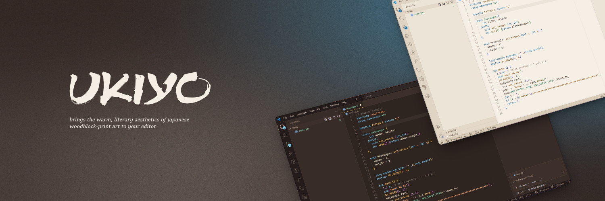

<div align="center">

# Ukiyo Themes

**A collection of cozy, ink-and-paper color schemes for Visual Studio Code.**  

[](https://marketplace.visualstudio.com/items?itemName=nzkdevsaider.ukiyo-themes)
[](https://marketplace.visualstudio.com/items?itemName=nzkdevsaider.ukiyo-themes)
[](./LICENSE)

</div>

---

## Overview

Ukiyo Themes brings the warm, literary aesthetics of Japanese woodblock-print art to your editor. Each scheme is designed for long coding sessions — soft contrast, legible typography-friendly palettes, and carefully chosen syntax colors that don't strain the eyes.

---

## Included Themes

| Theme                     | Variants     |
| ------------------------- | ------------ |
| **Cozy Typewriter**       | Dark · Light |
| *More themes soon...*     |              |

---

## Installation

### Via VS Code Marketplace _(recommended)_

1. Open VS Code
2. Go to **Extensions** (`Ctrl+Shift+X` / `Cmd+Shift+X`)
3. Search for **Ukiyo Themes**
4. Click **Install**

### Manual (VSIX)

```bash
# 1. Clone the repository
git clone https://github.com/nzkdevsaider/vscode-ukiyo-themes.git
cd vscode-ukiyo-themes

# 2. Install the packaging tool (if needed)
npm install -g @vscode/vsce

# 3. Package the extension
vsce package

# 4. Install the generated .vsix file
code --install-extension ukiyo-themes-*.vsix
```

## Activating the Theme

1. Open the Command Palette (`Ctrl+Shift+P` / `Cmd+Shift+P`)
2. Run **Preferences: Color Theme**
3. Select any **Ukiyo** theme from the list

## Recommended Settings

For the best experience, pair this theme with a serif or monospace font that complements its literary feel:

```jsonc
{
  "editor.fontFamily": "'iA Writer Mono S', 'Courier Prime', monospace",
  "editor.fontSize": 14,
  "editor.lineHeight": 1.8,
  "editor.fontLigatures": true,
}
```

## Contributing

Bug reports, palette suggestions, and pull requests are welcome.

1. Fork the repository
2. Create a feature branch: `git checkout -b feat/my-improvement`
3. Commit your changes and open a Pull Request

## License

Distributed under the [MIT License](./LICENSE).
